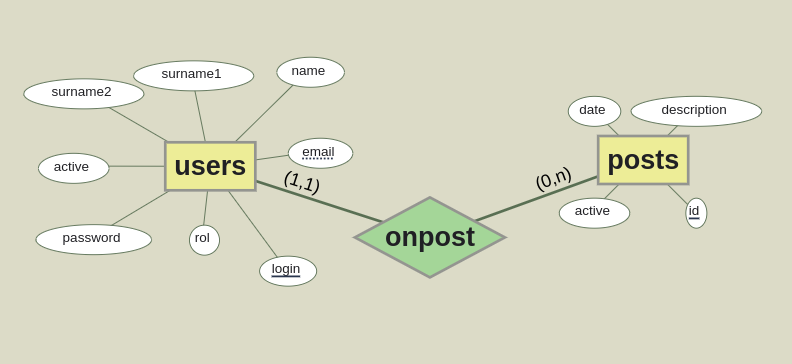

# ejercicio-anuncios
Ejercicio a completar de una pequeña aplicación web para la publicación de anuncios , gestión de usuarios, gestión de anuncios.

# Pasos para crear una aplicación web.

Como todo tipo de software, antes de empezar su desarrollo es conveniente comenzar a realizar un análisis y un diseño previo, este paso será el que nos definirá los objetivos del mismo así como la forma de la implementación.

## Análisis preliminar de los requisitos de funcionamiento.
1. Nuestra aplicación web se basará en un sistema de publicación básico de anuncios por palabras.
2. Tendremos tres roles de funcionamiento en la aplicación un usuario no registrado y (dos tipos de usuarios) los administradores y los usuarios registrados.

Por ello esta aplicación proporcionará los siguientes servicios en en el front-end o parte pública para los usuarios no registrados.
- Visualizar todos los anuncios por palabras ordenados desde los más recientes a los más antiguos.
- Permitir registrarse en el sistema.
- Permitir autenticarse en el sistema.

Los administradores accederán a la parte de administración una vez autenticados. En esta parte se ofrecerán las siguientes acciones.
- Activar usuarios.
- Eliminar usuarios
- Activar anuncios. (Sólo se mostraran los activos)
- Eliminar anuncios.
  
Los usuarios registrados accederán a la parte de publicación de anuncios. En esta parte se ofrecerán las siguientes acciones.
- Publicar anuncios.
- Eliminar anuncios (Sólo los asociados al usuario registrado)
- Cambiar su contraseña de acceso.

## Modelo E/R para las tablas creadas en install.php

